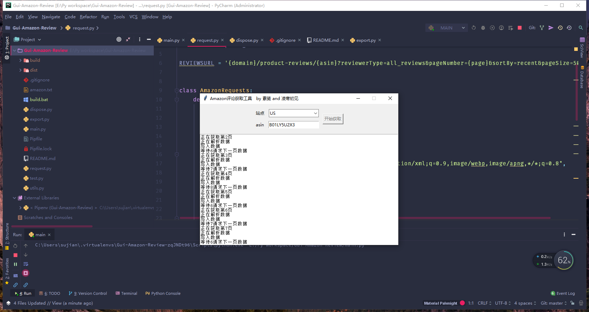

# 下载亚马逊评论工具
一个小改改时不时找我做一个Google扩展来下载Amazon的评论以提高工作效率，奈何时间一直不在这一块，刚好同学也接到了这个需求，就打算一起做一个。

最后商量还是做一个Gui，Google扩展有时候感觉有些不方便，顺带了解一下Python中的标准库tkinter。

最后分工我来做界面，同学来写下载解析那一块，说说一下思路，其实还是很简单的，就跟普通的爬虫差不多。

- Gui提供2个参数，一个是站点，一个是产品Asin,Gui的具体界面就不仔细说了
- 通过2个参数，可以构建一个种子Url，先会检测产品是否存在（404）
- 检测通过后，然后开始开启线程递归下载
- 下载完成后，解析数据保存到本地
- 判断是否存在下一页，存在则修改header继续下载解析，直到最后一页

没有使用代理，因为数据量小，防止被ban，加了一些延时请求，如果有需要的朋友可以自行添加。

最后建议一下，简单的页面可以是用tkinter，复杂可以使用其他Gui库，比如pyqt，tkinter实现复杂的页面有点费劲。

下载地址[https://github.com/sujianqingfeng/Gui-Amazon-Review/releases/download/0.3/Amazon-Review_0.3.exe](https://github.com/sujianqingfeng/Gui-Amazon-Review/releases/download/0.3/Amazon-Review_0.3.exe)

源码地址[https://github.com/sujianqingfeng/Gui-Amazon-Review](https://github.com/sujianqingfeng/Gui-Amazon-Review)，求星星😊

